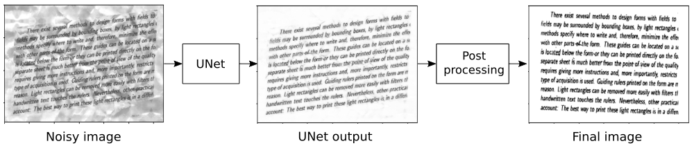

# Document CleanUp
-----



## Description

Many image processing applications make use of digitalized textual data. However, the presence of any type of noise can create difficulties in post-processing information, such as on OCR detection. To improve the information manipulation on such data, a previous image processing step is required.

In light of this idea, a set of text paragraphs containing plain English language was collected. Different font styles, size, and background noise level were arranged to simulate the a variety of scenarios.

## Objective

The objective of this test is to evaluate the possible image processing methods that could fix the text samples. Note that the samples have a different type of background noise and present a set of text fonts. Therefore, the candidate should provide a flexible algorithm that can correctly detect what is text characters and background noise, offering a clean version of each text paragraph as result.

## Preparing environment

Create conda env:
```
$ conda create -n <env_name> python=3.7
$ conda activate <env_name>
```

Install the requirements:
```bash
$ conda install pytorch==1.1.0 torchvision==0.3.0 -c pytorch
$ pip install -r requirements.txt
```

## Running

Run the following command to perform document cleaning for the test dataset.

```bash
$ python cleanup.py
```

optional arguments:
| Arg | type | Description | Default |
| ----- | ----- |----- | ----- |
| --input_folder | str | Folder containing images to be cleaned. | dataset/test/noisy_data |
| --output_folder | str | Folder where the processed imagens will be saved. | dataset/test/clean_data |
| --debug | str | Run in debug mode. [y/n] | n |

## Training

If you would like to retrain the inference model, just execute the following command.

```bash
$ python tools/train.py --filename <give_a_name_to_the_model>
```
The new model will be saved in the */net_weights* folder with the specified filename.

## Other scripts
* **tools/bg_generator.py**: This script is responsible to generate backgrounds from noisy images. It basically applies a median filter and another morphologycal operations to extract background noise that can be used to generate a new dataset.
* **tools/dataset_generator.py**: This script combine background noise with plain text images to produce a new noisy data which can be used to train a network model.