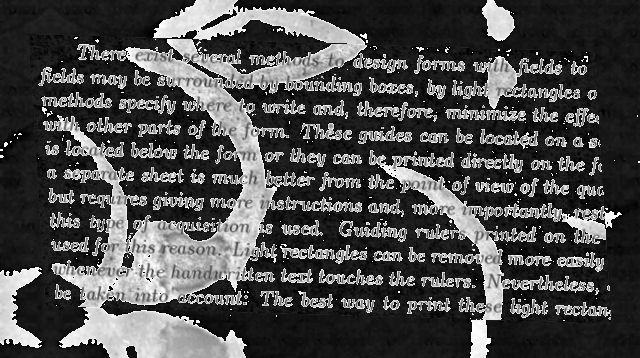
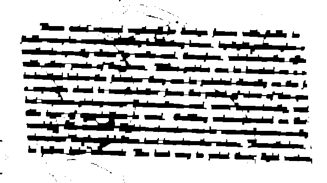
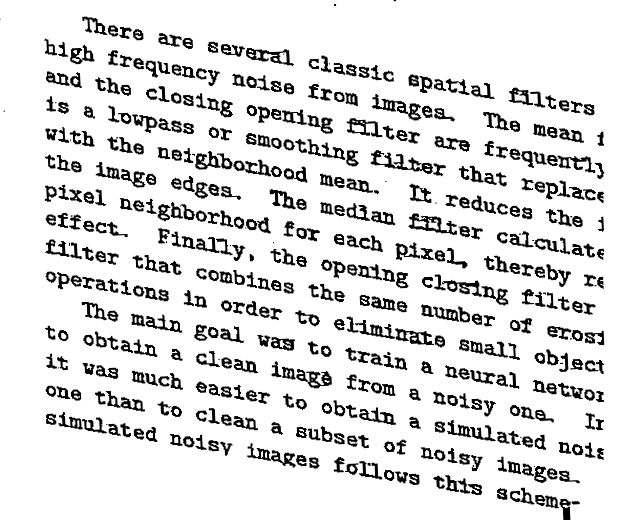
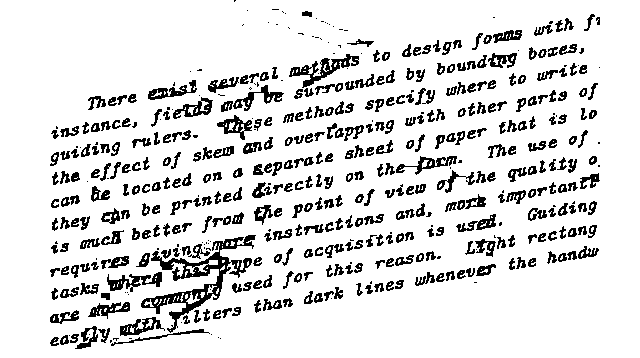

# 01-DOCUMENTCLEANUP

The objective here is to create a script able to clean the image document data to turn better the extraction or learning of the document.

To do this it was made a python script with a routine to this.

# HOW THE PROBLEM WERE ADRESSED

Instead of using more classical approachs like machine learning to clean the data, here was used image processing thechines to filter and clean the text.

To filter and turn beter the component separation in the image was used the `Discrete Wavelet Transform`, this transform allows us to capture frequency and location information it is good because that way is possible to separate the image by image component in the frequency. Bellow a image showing the result of this Wavelet:



Some processing have been done to turn better the image. The idea is to highlight the text in the image and ignore the background, to do so, after some filtering and mophologycal opeartions the text was highlighted like the flowing image:



Having only the position of the texts we apply a mask to get the text in the original image and threshold more easly the text.

As final result we got some images good to read and others that the text quality were afected. Bellow a sample of each one:

A good filtering



Exemple of a bad filtering




The rotation correction was done, but does not worked to all images. The idea is detect the rectangle were the text are and get the rotation of that rect.


# HOW TO RUN

This code is relatively simple to run. The requirements are:

|package|version|
|:------|:-----:|
|OpenCV | 4.4.0 |
|PyWavelts|1.1.1|
|Numpy  | 1.18.5|

Then just type

```
python main.py [path to image]
```

The output of the code will be a sabed image with name *clearned.png* int the current directory.