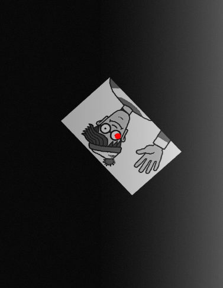
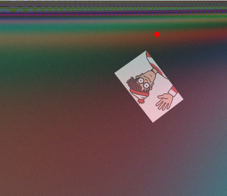

# WHERE IS WALLY

This is a python script to resolve the problem of find Wally in a image. The idea is, given a input image return the center position of the bounding box where are marking Wally.

To do so, there is a complete pipeline to train a neural network and do this predictions, flowing this file is showed how the solution where done.

> NOTE: If you want to see how to run go to the end of this file

# HOW THE PROBLEM WAS ADRESSED

There are so many ways to solve this problem.

Here a different approach was tried than the common to solve this problem. The premisse is `Let's try to do a regression model to learn the features and try predict the center point of the object (in this case Wally)` instead of make a object detection model with all the resources of object detection (selective search, region-based, etc).

> NOTE BY AUTHOR: I'm not sure if this approach works well but I'll try it.

Flowing is presented some steps used to solve the problem.

## Initial image analysis

As all machine learning and computer vision project the begining is to do a initial analysis in the images. So some analysis was done:

- Check if the labels points makes sense (if is not far to the Wally)
    Here was detected some wrong points 
- Check if the bounding boxes are correctly
    Also wrong bounding boxes, that does not cover all the image of Wally

To solve it, the wrongs images were removed from the dataset leaving only images which the bounding box makes sense.

## Data Augmentation

Whereas the dataset is too small was did some data augmentation proccess. This task was done manually to ensure that the labels will not be lost.

The process was:

- Random rotation
- brightness transform

this transormations you can see in the file `src/scripts/augment_data.py`

## Dataset

Done all the data preparation it's time to put the dataset in tensors to train and/or test.

This step consist in create tuples (image,label) dataset, all the process was done in the file `src/gen_dataset.py`.

The basic thinking of this file is read all the .jpg files in the folder dataset, open the csv with labels and map the labels to its image, decode the image and normalize, then the dataset is shuffled latly splited into train and test sets.

## Model

As said, the model consist in a regression model.

To do this as we have very little images in the dataset was used the technique of transfer learning with a pre trained deep neural network. In the image below are showed the model summary.


The training hiperparameters used to train:

- optimizer: Adam
- learning_rate: 16e-4
- loss: Mean Squared Error
- metric: Root Mean Squared Error

# RESULTS

How we treat the model as a regression model the results are showed as error metric, to it was chosen MeanAbsoluteError (because this one is good to represent the real errors without considering directions or outliers).

As the dataset was splitted in 90% training and 10% validating this last one correspond to 44 images.

The test was runned two times shuffling the dataset to get diferents test set each time and the end result was an error of `6.34%`.

The plots of the history in training and testing the model shows that after some time running the model don't improve, but does not presented some overting, just many noise in the values.

RMSE of the model


Loss


Bellow are the plots of some good and bad predicions:







> The CSV with the final predicion is found in `predicions_result.csv`.

## Comments

Analysing this result, it is not so good because this error causes a big desviation in the original point. In most of the case the point is into the image (Wally), but it is not so aligned in the center.

This model should be improved. To do it some actions must be taked in account, the main is to improve the data. Some data augmentation have been made but we can be more. To avoid this problem also have been used Transfer Learning techinique to improve (and realy imporved).

Maybe the model was not so good too because the approach, this approach is used in the basics object location problens *(and I never have used like that)*.


# HOW TO RUN

This package is easy to run but you have to take some care. 

Below a brief description of the files.

- `task.py`: this is in the root file where the tasks are setted, you will run it when running the code
- `src/`:
    - `gen_dataset.py`: All the data processing to read and generate the input dataset to the model;
    - `model.py`: Here you will find the train and predict pipelines;
    - `model_build.py`: The construction of the model (model architecture);
    - `scripts/`:
        - `plot_history.py`: Just a script to plot the history of the training.
        - `augment_data.py`: Operations of data augmentation.
        - `data_analysis.py`: **You don't need this file**, are just some scripts to run some analysis and visualization of the data. The goal here is just debug the data.

### RUN LIKE THIS

To train the model:

```
python task.py train
```

```
python task.py predict [path to the image to be predicted]
```

### Some considerations:

> The python version used was 3.6.9

> to train you should have a csv with the following colums: `image_name`,`center_x`, `center_y`, `image_width`, `image_height`